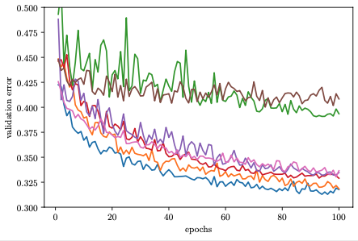
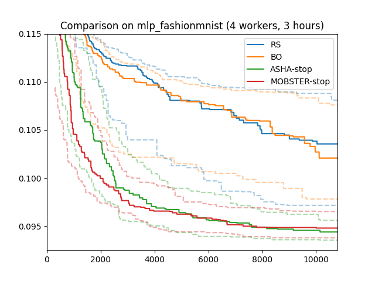
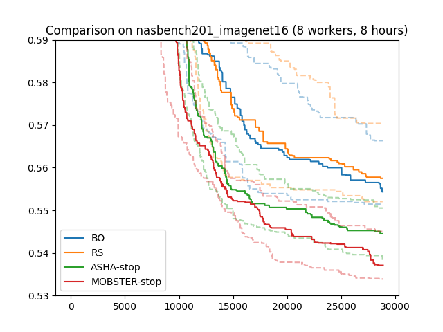
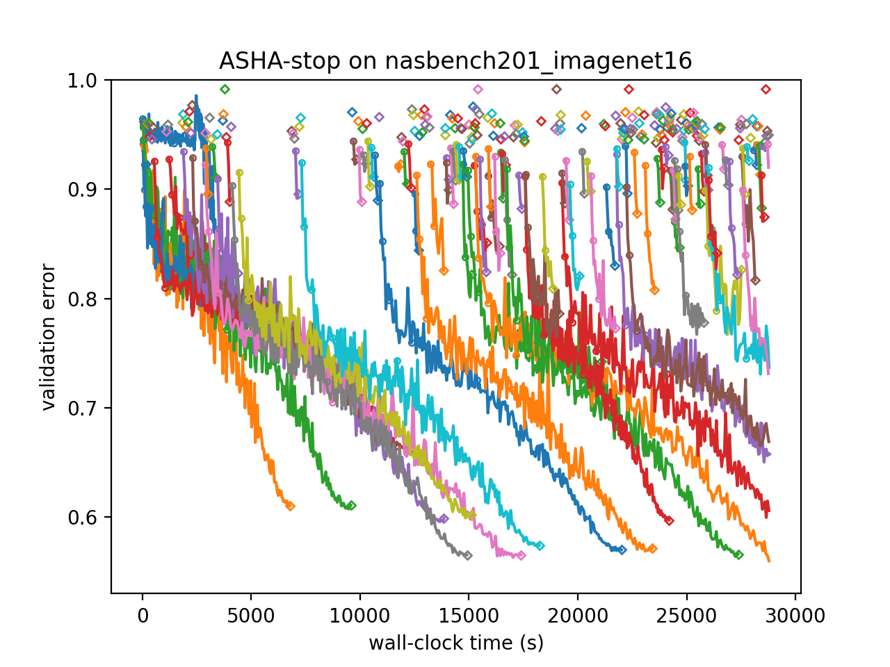
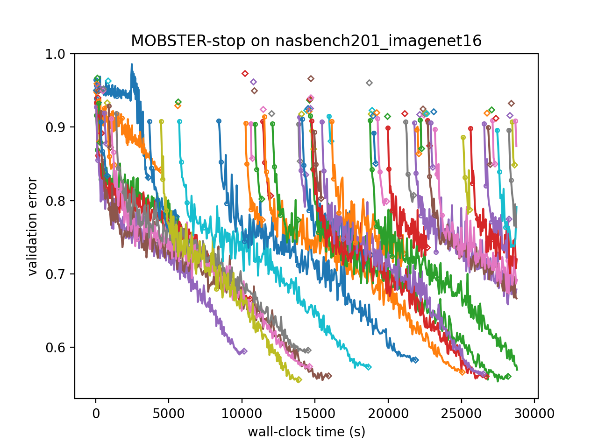

# Basics of Syne Tune: Model-Based Asynchronous Successive Halving

[[Previous Section]](basics_asha.md)

## Extrapolating Learning Curves

|    |
|:-----------------------------------------|
| Learning Curves (image from Aaron Klein) |

By modelling metric data from earlier trials, Bayesian optimization learns to
suggest more useful configurations down the line than randomly sampled ones.
Since new configurations are sampled at random in ASHA, a natural question is
how to combine it with Bayesian decision-making.

It is not immediately clear how to do this, since the data we observe per trial
are not single numbers, but learning curves (see Figure above). In fact, the
most useful single function to model would be the validation error after the
final epoch (81 in our example), but the whole point of early stopping
scheduling is to query this function only very rarely. By the nature of
successive halving scheduling, we observe at any point in time a lot more
data for few epochs than for many. Therefore, Bayesian decision-making needs
to incorporate some form of *learning curve extrapolation*.

One way to do so is to build a *joint probabilistic model* of all the data. The
validation metric reported at the end of epoch `r` for configuration `x` is
denoted as `f(x, r)`. In order to allow for extrapolation from small `r` to
`r_max` (81 in our example), our model needs to capture dependencies along
epochs. Moreover, it also has to represent dependencies between learning
curves for different configurations, since otherwise we cannot use it to
score the value of a new configuration we have not seen data from before.

## MOBSTER

A simple method combining ASHA with Bayesian optimization is
[MOBSTER](https://arxiv.org/abs/2003.10865). It restricts Bayesian
decision-making to proposing configurations for new trials, leaving scheduling
decisions for existing trials (e.g., stopping, pausing, promoting) to ASHA.
Recall from [Bayesian Optimization](basics_bayesopt.md#what-is-bayesian-optimization)
that we need two ingredients: a surrogate model `f(x, r)` and an acquisition
function `a(x)`:
* Surrogate model: MOBSTER uses joint surrogate models of `f(x, r)` which
  start from a Gaussian process model over `x` and extend it to learning
  curves, such that the distribution over `f(x, r)` remains jointly Gaussian.
  This is done in several different ways, which are detailed below.
* Acquisition function: MOBSTER adopts an idea from
  [BOHB](https://arxiv.org/abs/1807.01774), where it is argued that the
  function of interest is really `f(x, r_max)` (where `r_max` is the full
  number of epochs), so expected improvement for this function would be a
  reasonable choice. However, this requires at least a small number of
  observations at this level. To this end, we use expected improvement for
  the function `f(x, r_acq)`, where `r_acq` is the largest resource level
  for which a certain (small) number of observations are available.

These choices conveniently reduce MOBSTER to a Bayesian optimization searcher
of similar form than without early stopping. One important difference is of
course that a lot more data is available now, which has scaling implications
for the surrogate model. We will come back to this point below.

## Launcher Script for MOBSTER

Stepping from ASHA to MOBSTER is just as simple as stepping from random search
to Bayesian optimization. Please have a look at
[launch_mobster_stopping.py](scripts/launch_mobster_stopping.py):
* [1] Compared to the launcher script for ASHA, the only difference is that
  `searcher='bayesopt'`. Also, this searcher comes with more options,
  which we can set via `search_options`. Apart from `num_init_random`, we also
  choose the surrogate model via `gp_resource_kernel` in our example. More
  details on this choice are given below.

Note that, despite the similar usage, the searchers are represented by
different code, depending on whether `FIFOScheduler` or `HyperbandScheduler`
are used. For one, surrogate models are more complex in the case of learning
curves. Also, we need to deal differently with pending evaluations from running
trials.

## Results for MOBSTER

|  |
|:--------------------------------------------------------------|
| Results for MOBSTER                                           |

Here are results for our running example (4 workers; 3 hours; median, 25/75
percentiles over 50 repeats). MOBSTER performs comparably to ASHA on this
example. As with Bayesian optimization versus random search, it would need
more time in order to make a real difference.

### Results on NASBench201 (ImageNet-16)

|  |
|:------------------------------------------------------------------|
| Results on NASBench201 (ImageNet-16)                              |

We repeated this comparison on a harder benchmark problem:
[NASBench-201](https://arxiv.org/abs/2001.00326), on the ImageNet-16 dataset.
Here, `r_max = 200`, and rung levels are `1, 3, 9, 27, 81, 200`.
We used 8 workers and 8 hours experiment time, and once more report median
and 25/75 percentiles over 50 repeats. Now, after about 5 hours, MOBSTER
starts to break away from ASHA and performs significantly better.

| ASHA | MOBSTER                                           |
| --- |---------------------------------------------------|
|  |  |

In order to understand why MOBSTER outperforms ASHA, we can visualize the
learning curves of trials. In these plots, neighboring trials are assigned
different colors, circles mark rung levels, and diamonds mark final rung levels
reached. We can see that ASHA continues to suggest poor configurations at a
constant rate. While these are stopped after 1 epoch, they still take up valuable
resources. In contrast, MOBSTER quickly learns how to avoid the worst
configurations and spends available resource more effectively.

## Learning Curve Surrogate Models

MOBSTER in Syne Tune supports a range of different surrogate models for
`f(x, r)`. They are selected by the arguments `model` and `gp_resource_kernel`
as part of `search_options`. If `model='gp_multitask'` (the default), a
Gaussian process multi-task model is used, the kernel function of which is
selected by `gp_resource_kernel`. Multi-task models are most flexible and easy
to implement, but computations scale cubically in the total number of
observations. The choices for `gp_resource_kernel` are documented in
[GPMultiFidelitySearcher](../../../syne_tune/optimizer/schedulers/searchers/gp_multifidelity_searcher.py).

Due to the unfavourable scaling of GP multi-task models, the surrogate model is
typically not fit to all the data. This depends on the `searcher_data` argument
of `HyperbandScheduler`:
* `searcher_data='rungs'` (default): Only metric data reported at rung levels
  is used to fit the surrogate model. In other words, searcher and scheduler
  make their decisions based on the same data.
* `searcher_data='all'`: All metric data is used to fit the surrogate model.
* `searcher_data='rungs_and_last'`: Uses data at rung levels and the most
  recent observation for each trial.

Computations can also be sped up by using `opt_skip_period` in `search_options`.

### Gaussian Additive Models

As shown in [Freeze-Thaw Bayesian Optimization](https://arxiv.org/abs/1406.3896),
we can avoid cubic scaling in the total number of observations by making the
assumption `f(x, r) = g(r | x) + h(x)`, where `h(x)` has a Gaussian process
prior, and `g(r | x)` has a Gaussian distribution over `r`, which may depend
on `x`. Here, the curves `g(r | x)` are *independent* for different `x`. For
such Gaussian additive models, computations scale cubically in the number of
trials, but not in the total number of observations. MOBSTER supports different
Gaussian additive models. `model='gp_expdecay'` is a slight variation of the
Freeze-Thaw model, while `model='gp_issm'` uses a basic forecasting model to
represent `g(r | x)`.

Gaussian additive models are fit to all metric data. In fact, trials must
report metrics after each epoch, and we require `searcher_data='all'` in
`HyperbandScheduler`.

In the [next section](basics_promotion.md), we will learn about
promotion-based scheduling and checkpointing of trials.
